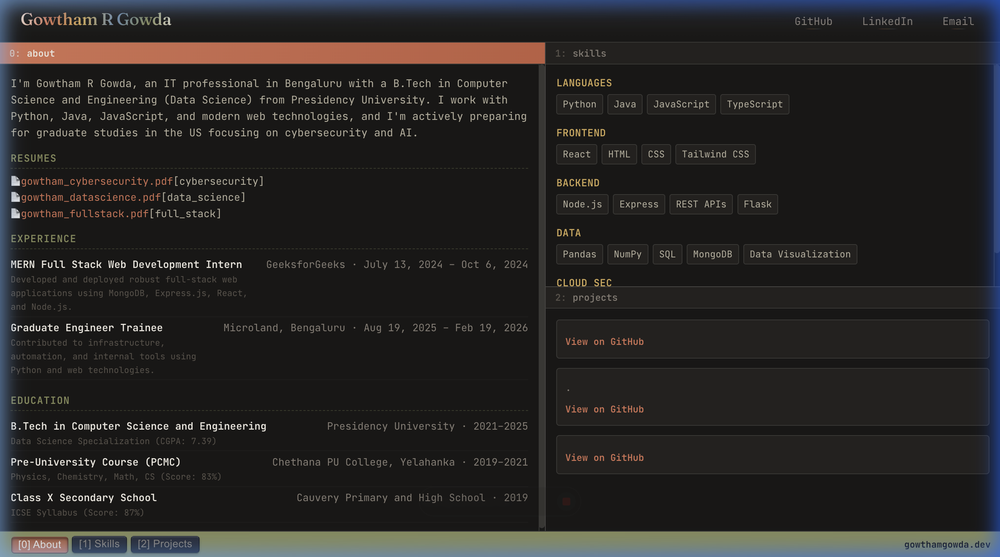

# Retro-Futuristic tmux Dashboard Portfolio

A premium, interactive developer portfolio designed around the **Terminal Multiplexer (`tmux`)** layout. Built with **React**, **Vite**, and styled with custom glassmorphism and tactical retro-futuristic aesthetics.



---

## 🚀 Key Features

*   **tmux Multiplexer Model**: The screen is split into a **2x2 grid** containing 3 interactive panes (About, Skills, Projects). Each pane operates independently, managing its own scrolling and state.
*   **Interactive Navigation**: Click any pane or click the status bar tabs in the footer to instantly focus and activate that pane.
*   **Calculator-style Status Bar**: Physical-like push buttons at the footer representing active workspace segments.
*   **Iridescent Text Effects**: Elegant glassmorphism and 3D tilting logo effect using pure CSS perspective math on hover.

---

## 📂 Pane Structure

1.  **`[0] About`**: Introduction, bio, and background.
2.  **`[1] Skills`**: Technical capabilities visualized in clean categorizations.
3.  **`[2] Projects`**: Filterable grid displaying personal creations, code details, and deployment targets.

---

## 🛠️ Technology Stack

*   **Core**: React (HTML5 / JS / JSX)
*   **Styling**: Pure CSS (Vanilla CSS with CSS Custom Properties, flexbox/grid layout, 3D transform effects)
*   **Build Tool**: Vite (Ultra-fast Hot Module Replacement)

---

## 💻 Local Setup & Development

To get this project running on your computer:

1.  **Install dependencies**:
    ```bash
    npm install
    ```

2.  **Start the local development server**:
    ```bash
    npm run dev
    ```

3.  **Build the production-ready bundle**:
    ```bash
    npm run build
    ```

4.  **Preview the production build locally**:
    ```bash
    npm run preview
    ```
